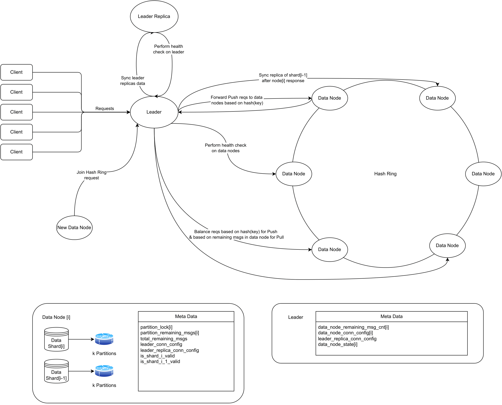

# TurtleMQ

This is a MVP of a message queueing system.

## Architecture

Design graph of this system is like below:



## How to build locally

Datanode implementation is in Python and it doesn't require any build process.
Leader implementation is in Golang and in order to use it you can use it's `Makefile`.
First cd in to `./leader`:

```bash
cd leader
make leader
```

## How to run locally

This project is containerized.
Run the `test.docker-compose.yaml` with `latest` tag to run with docker compose:

```bash
docker compose -f test.docker-compose.yaml up -d
docker compose -f test.docker-compose.yaml logs -f
docker compose -f test.docker-compose.yaml down
```

## Clients

Clients are implemented in Python and Golang. Import them accordingly and use them.

Python:

```
from client_py.client import QueueClient


if __name__ == '__main__':
    c = QueueClient()
    
    c.push('test_key', b'test_value')
    
    k, v = c.pull()
    print(f'key={k}, value={v}')
    
    c.subscribe(lambda k, v: print(f'key={k}, value={v}'))
```

Golang:

```
import (
    "fmt"

    "github.com/kysre/TurtleMQ/client_go"
)

func testFunc(k string, v []byte) {
    fmt.Printf("key=%s, value=%b", k, v)
}

func main() {
    c := client_go.GetQueueClient()

    c.Push("test_key", []byte("test_value"))

    k, v := c.Pull()
    fmt.Printf("key=%s, value=%b", k, v)

    c.Subscribe(testFunc)
}
```
